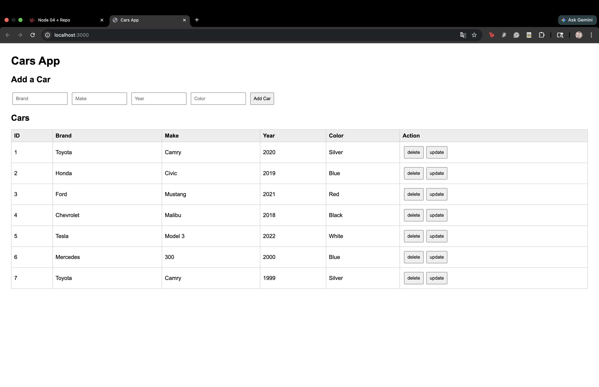
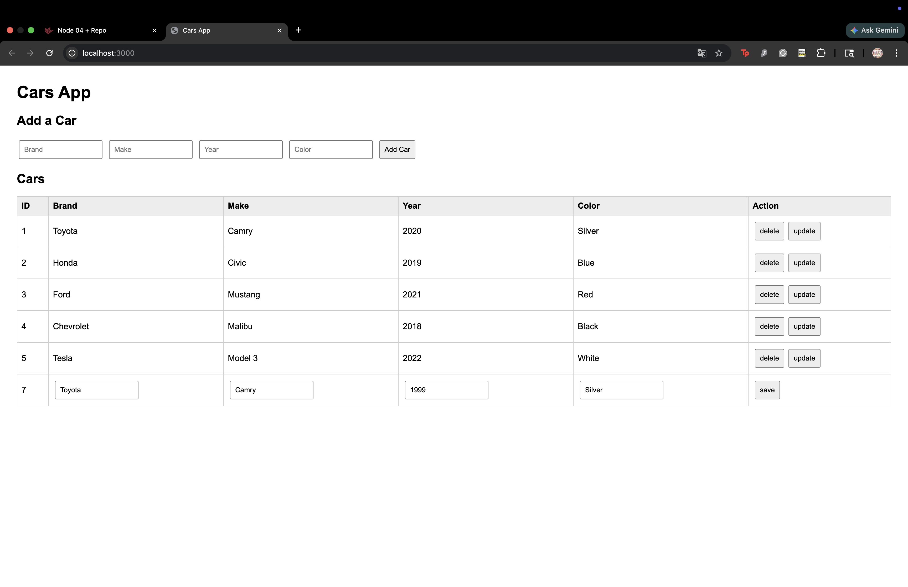
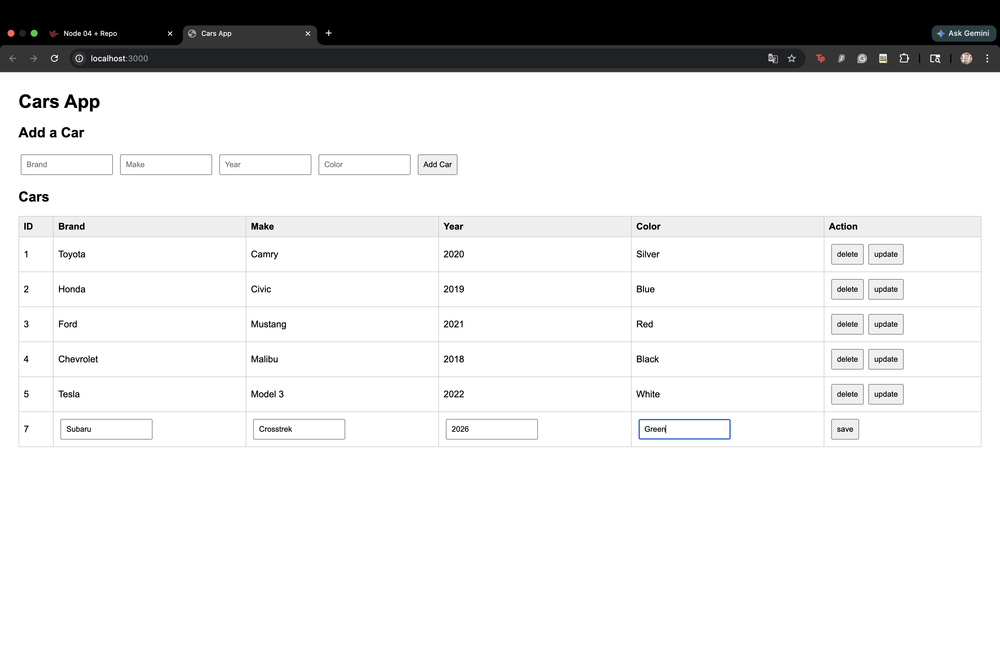
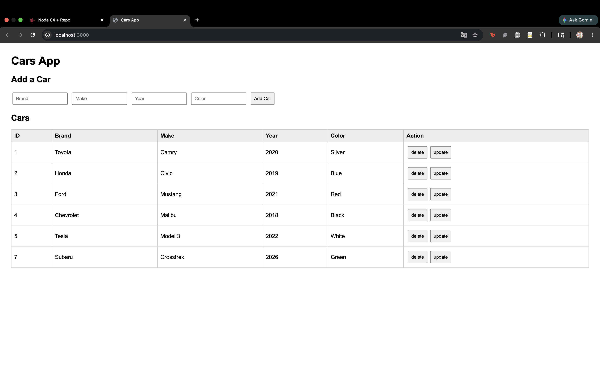

## How I Solved the Problem

For the delete feature, I created a button named `delete` for each row. When the user clicks this button, the code gets the car's ID from the row and sends a `DELETE` request to `/api/cars/:id`. This tells the server which car record should be removed. After the server finishes deleting the car, I call `loadCars()` again. This clears the old table and reloads the current list of cars, so the deleted car no longer appears on the page.

For the update feature, I created a button named `update` for each row. When the user clicks this button, the car's current values in the table are changed into input boxes. This allows the user to edit the brand, make, year, and color directly inside the table row.

After the row changes into input boxes, the delete and update buttons are hidden, and a new `save` button is added. This prevents the user from clicking delete or update while the row is already being edited.

When the user clicks the save button, the code reads the values from the input boxes and creates an `updatedCar` object. Then it sends a `PUT` request to `/api/cars/:id` with the updated car data in JSON format. This tells the server to replace the old car information with the new information. After the update is finished, I call `loadCars()` again so the table refreshes and displays the updated record.

## Screenshots and Explanation of What Is Happening

### Cars Table Loaded and Added Some Cars

This screenshot shows the page after `index.html` loads and after some car records have been added. The app sends a `GET` request to `/api/cars`, receives the list of cars from the server, and displays them in the table. Each row represents one car record. The Action column contains the delete and update buttons that I added.

### Delete Button After Clicking

This screenshot shows what happens after the delete button is clicked. The selected car is removed from the data on the server using a `DELETE` request. Then `loadCars()` runs again, so the table refreshes and the deleted car disappears from the page.

### Update Mode After Clicking Update

This screenshot shows what happens after the update button is clicked. The text values in the row change into input fields. The user can now edit the brand, make, year, and color. The delete and update buttons are hidden, and a save button appears so the user can submit the changes.

### Update Mode with Edited Input Values

This screenshot shows the page after the update button has been clicked and new values have been typed into the input fields. At this point, the record has not been saved yet. The table row is only in edit mode, so the changes are visible on the page but have not been sent to the server. The user must click the save button to send a `PUT` request and actually update the car record.

### After Saving the Updated Car

This screenshot shows the result after the save button is clicked. The program collects the new input values and sends them to the server using a `PUT` request. After the server updates the record, `loadCars()` runs again and the table displays the updated car information.